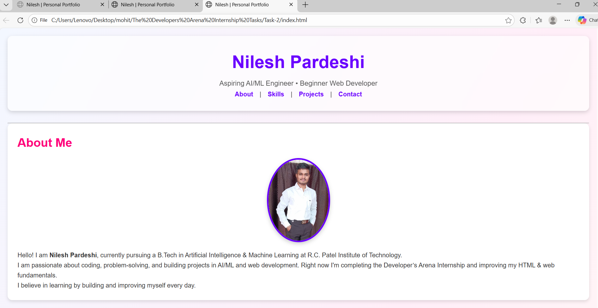
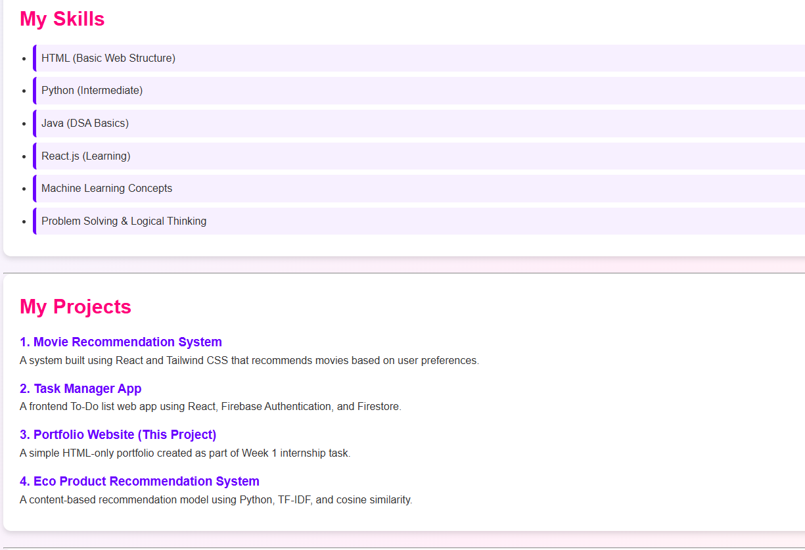
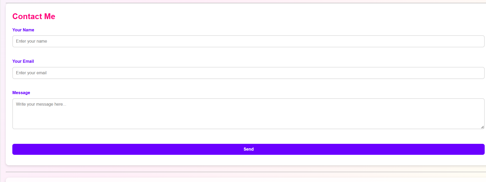

# Styled Portfolio Website – Week 2

## Overview
This project extends the Week 1 HTML portfolio by adding CSS styling. 
It focuses on layout, colors, typography, hover effects, and responsive design.

## Technologies Used
- HTML5
- CSS3 (Flexbox & Media Queries)

## Setup Instructions
1. Clone the repository
2. Open index.html in a browser
3. Ensure style.css is linked correctly

## CSS Concepts Used
- CSS selectors (element, class, pseudo-class)
- Box model (margin, padding)
- Hover effects
- Responsive design using media queries

## Folder Structure
index.html  
style.css  
images/  
screenshots/  

## Screenshots

## Conclusion
This task helped me understand CSS styling, layout management, and responsiveness.
